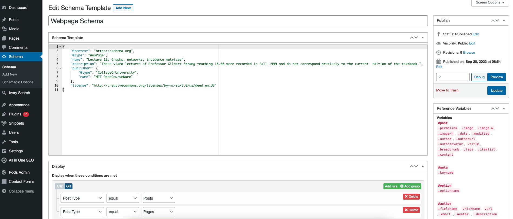
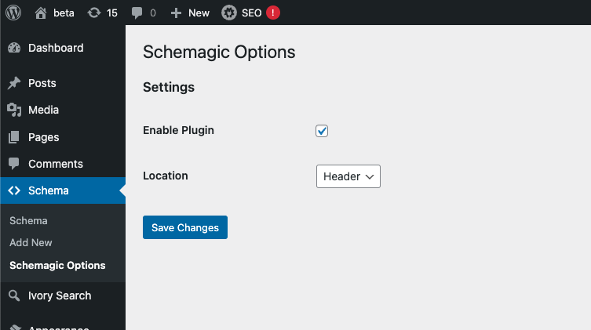

=== Schema Magic ===
Contributors: Jignesh Patel
Author link: [Website](https://imjignesh.com)
Tags: schema, template, dynamic values
Requires at least: 3.0.1
Tested up to: 3.4
Stable tag: 0.0.1
License: GPLv2 or later
License URI: http://www.gnu.org/licenses/gpl-2.0.html

== Description ==

Schema Magic is a powerful WordPress plugin that simplifies the creation of dynamic schema templates. It enables you to generate structured data schemas with ease, making your website content more accessible to search engines.

With Schema Magic, you can define custom templates and populate them with dynamic values from your WordPress site. This plugin streamlines the process of adding structured data to your web pages, improving your SEO and enhancing the way your content appears in search results.

== Installation ==

1. Upload the `schema-magic` directory to the `/wp-content/plugins/` directory.
2. Activate the plugin through the 'Plugins' menu in WordPress.
3. Start creating dynamic schema templates and boost your website's SEO.

== Frequently Asked Questions ==

= What can I do with Schema Magic? =

Schema Magic allows you to create structured data schemas for your content, making it more search engine-friendly. You can define custom templates and populate them with dynamic values from your WordPress site.

= How do I create a schema template? =

To create a schema template with Schema Magic, follow these steps:

1. Install and activate the plugin.
2. Go to the 'Schema Templates' menu in your WordPress dashboard.
3. Click 'Add New' to create a new template.
4. Define the schema type and add fields with dynamic values.
5. Save the template, and you're ready to use it across your website.

== Screenshots ==

1. 
   Creating a dynamic schema template with Schema Magic.

2. 
   Defining fields with dynamic values for structured data.

== Changelog ==

= 1.0 =

- Initial release of Schema Magic.

== Upgrade Notice ==

= 1.0 =
Boost your website's SEO by creating structured data schemas with Schema Magic.

== Arbitrary section ==

You may provide additional information or customization options specific to your plugin in this section.

== A brief Markdown Example ==

Schema Magic allows you to:

Ordered list:

1. Create custom schema templates.
2. Populate templates with dynamic values.
3. Improve your website's SEO.

Unordered list:

- Enhance search engine visibility.
- Boost click-through rates.
- Stand out in search results.

Here's a link to [WordPress](http://wordpress.org/ "Your favorite software") and one to [Markdown's Syntax Documentation][markdown syntax].
Titles are optional, naturally.

[markdown syntax]: http://daringfireball.net/projects/markdown/syntax "Markdown is what the parser uses to process much of the readme file"

Markdown uses email-style notation for blockquotes, and I've been told:

> Asterisks for _emphasis_. Double it up for **strong**.

`<?php code(); // goes in backticks ?>`
